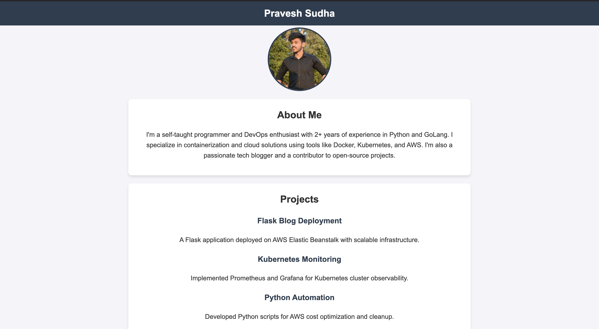

# Flask Portfolio Website

This is a Flask-based portfolio website that showcases an "About Me" page, personal projects, and a photo. The application is styled with a clean and modern design, making it visually appealing and user-friendly.

## Features

- **Navbar**: Contains your name prominently in the center.
- **About Me Section**: A personal introduction with a brief bio.
- **Projects Section**: Highlights selected projects with their descriptions.
- **Profile Photo**: Displays a professional photo at the top of the page.
- **Responsive Design**: Ensures the site looks great on all devices.

## Preview



## Project Structure

flask-portfolio/
├── application.py   # Main Flask application
├── static/
│   ├── css/
│   │   └── styles.css   # Custom CSS styles
│   └── img/
│       └── profile.jpg  # Profile photo
├── templates/
│   └── index.html      # Main page
├── requirements.txt   # Python dependencies
└── README.md          # Project documentation


## Requirements

- Python 3.7 or above
- Flask 2.0 or above

## Installation

1. **Clone the Repository:**
   ```bash
   git clone https://github.com/your-username/flask-portfolio.git
   cd flask-portfolio
   ```

2. **Create a Virtual Environment:**
   ```bash
   python3 -m venv venv
   source venv/bin/activate  # On Windows, use venv\Scripts\activate
   ```

3. **Install Dependencies:**
   ```bash
   pip install -r requirements.txt
   ```

4. **Run the Application:**
   ```bash
   python application.py
   ```

5. **Open in Browser:**
   Visit `http://127.0.0.1:5000` in your web browser.

## Deployment on AWS Elastic Beanstalk

1. **Package the Application:**
   Ensure your project files are zipped, excluding unnecessary files (like `venv` or `.git`).

2. **Deploy on Elastic Beanstalk:**
   Follow these steps to deploy:
   - Initialize Elastic Beanstalk:
     ```bash
     eb init
     ```
   - Create and deploy the environment:
     ```bash
     eb create flask-portfolio-env
     eb deploy
     ```

3. **Access Your Application:**
   Once the deployment is complete, access your app via the provided Elastic Beanstalk URL.

## Customization

- **Modify Content:**
  Update the `index.html` file in the `templates` folder to change your bio, projects, and other details.

- **Change Styling:**
  Edit the `styles.css` file in the `static/css` folder for custom styles.

## Contributing

If you'd like to contribute to this project:
1. Fork the repository.
2. Create a new feature branch.
3. Submit a pull request.

## License

This project is licensed under the MIT License. See the [LICENSE](LICENSE) file for details.

---

Feel free to customize this README further based on your preferences or additional features in the project.
```  

Would you like any additional sections or customizations in this README? 😊
